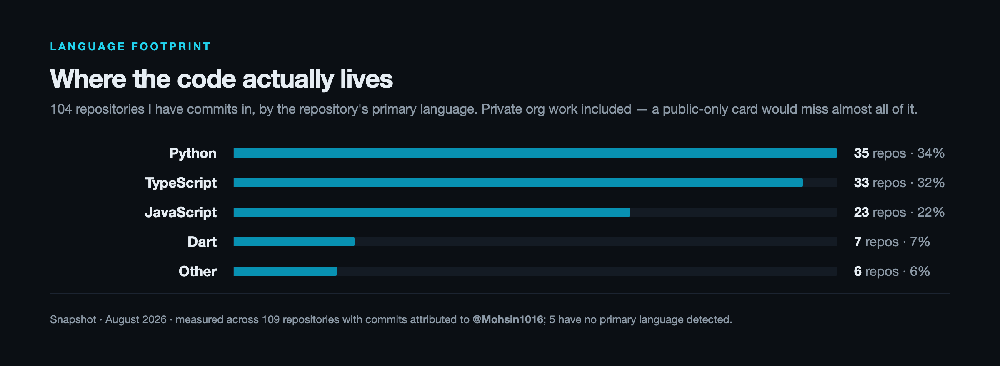

<picture>
  <source media="(prefers-color-scheme: dark)"  srcset="assets/banner-dark.png">
  <source media="(prefers-color-scheme: light)" srcset="assets/banner-light.png">
  
</picture>

&nbsp;

&nbsp;

**109** repos contributed to &nbsp;·&nbsp; **7** production backends on my Django template &nbsp;·&nbsp; **92%** authored on GoProperli &nbsp;·&nbsp; **6** orgs shipping

---

### ▸ Now

Building **Evolve7** — an intelligent life operating system in Flutter, on Riverpod and a feature-first clean architecture.

**Open to freelance and contract backend work.** &nbsp;→&nbsp; [muhammadmohsin1016@gmail.com](mailto:muhammadmohsin1016@gmail.com)

---

### ▸ Featured work

<table>
<tr>
<td width="50%" valign="top">

**01 · GoProperli** &nbsp;·&nbsp; 92% authored

Property-intelligence pipeline for foreclosure and probate acquisition. Scrapes county clerk records, matches legal descriptions back to folio numbers, runs AI case analysis, and syncs the results into a BigQuery warehouse.

Django · Celery · Playwright · Gemini · BigQuery · PostgreSQL · Docker

[→ Live](https://goproperli-frontend.vercel.app)

</td>
<td width="50%" valign="top">

**02 · B2R Thunder Road** &nbsp;·&nbsp; 64% authored

B2B outreach automation at scale. AI-personalised sequences, salesflow and scheduling, CRM sync across Clay, Attio and Reply.io, and a Chrome extension for data capture.

Django · Next.js · PostgreSQL · OpenAI · Clay · Attio · Reply.io · Outlook

[→ Live](https://thunderroad.b2rpartners.com/dashboard)

</td>
</tr>
<tr>
<td width="50%" valign="top">

**03 · Ctrl Assist**

Real-time call assistance — live transcription, translation and AI suggestions delivered over a low-latency audio pipeline.

Django · DRF · Next.js · WebRTC · Twilio · Deepgram · OpenAI · Docker

[→ Live](https://app.ctrlassist.com/login)

</td>
<td width="50%" valign="top">

**04 · DreamGuest**

Multi-tenant guest-management SaaS handling subscriptions, payments, background checks, digital contracts and real-time messaging.

React · Node.js · Express · MySQL · Stripe · SignWell

[→ Live](https://app.dreamguest.com/)

</td>
</tr>
</table>

### ▸ Also shipped

<table>
<tr>
<td width="33%" valign="top">

**CryptoWater** &nbsp;93% authored

NFT card marketplace with live auctions, countdown timers and real-time bidding.

Next.js 15 · React 19 · Socket.IO · Zod · Tailwind

[→ Live](https://pro-crypto-water-front.vercel.app)

</td>
<td width="33%" valign="top">

**PetzyPets** &nbsp;96% authored

Cross-platform pet-care app, built mobile-first with a TypeScript service behind it.

Flutter · Dart · TypeScript · PostgreSQL

</td>
<td width="33%" valign="top">

**AI-Guard**

Conversational visitor verification with automated security escalation, running daily at the gate.

Django · PostgreSQL · Retell AI · OpenAI

</td>
</tr>
</table>

---

### ▸ Engineering signals

**MomentIQ** — TikTok Shop analytics platform, a codebase of roughly 10,000 commits built by a large team. I contributed backend work into it:

- TikTok Shop OAuth routed through the cipher-returning `/authorization/202309/shops` endpoint
- Per-shop canary allowlists for bulk order, product and collaboration upserts, with write-performance levers
- Disabled server-side cursors and prepared statements for Postgres running under PgBouncer transaction pooling
- Repaired `NOT NULL` schema drift on `live_sessions` in production

The point of this entry is not volume — it is landing precise changes inside a large codebase I did not write.

**Django Template** — I authored the production Django scaffolding my company builds on: JWT auth, DRF, Celery, Docker and Swagger, generated by a setup script. **7 production backends run on it.**

---

### ▸ Stack

<!-- Explicit  : README files render with document semantics, where a single
     newline collapses to a space, so these five lines would otherwise run
     together into one paragraph. -->
**Backend** &nbsp; Python · Django · DRF · Node.js · Express · Celery · REST · WebSockets 
**Real-time & AI** &nbsp; OpenAI · Gemini · Deepgram · Retell AI · WebRTC · Twilio 
**Data** &nbsp; PostgreSQL · MySQL · MongoDB · BigQuery · Redis 
**Cloud & DevOps** &nbsp; AWS · Google Cloud · Docker · GitHub Actions · Vercel 
**Frontend & Mobile** &nbsp; React · Next.js · TypeScript · Tailwind · Flutter

---

### ▸ How I work

- **End-to-end ownership** — architecture, implementation, deployment, and the debugging afterwards. Not just the ticket.
- **Milestones that deploy** — scoped so there is something running at every checkpoint, rather than one big-bang delivery.
- **Direct async updates** — you always know what shipped and what is next.
- **Comfortable inheriting a codebase** — see the MomentIQ work above.

---

<picture>
  <source media="(prefers-color-scheme: dark)"  srcset="assets/stats-dark.png">
  <source media="(prefers-color-scheme: light)" srcset="assets/stats-light.png">
  
</picture>

