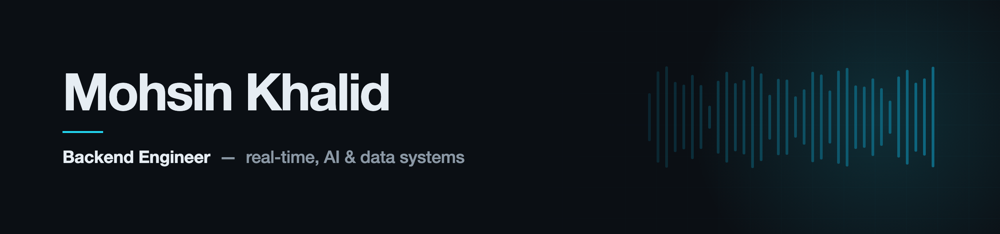

<picture>
  <source media="(prefers-color-scheme: dark)"  srcset="assets/banner-dark.png">
  <source media="(prefers-color-scheme: light)" srcset="assets/banner-light.png">
  
</picture>

&nbsp;

&nbsp;

**109** repos contributed to &nbsp;·&nbsp; **7** production backends on my Django template &nbsp;·&nbsp; **92%** authored on GoProperli &nbsp;·&nbsp; **6** orgs shipping

---

### ▸ Now

Building **Evolve7** — an intelligent life operating system in Flutter, on Riverpod and a feature-first clean architecture.

**Open to freelance and contract backend work.** &nbsp;→&nbsp; [muhammadmohsin1016@gmail.com](mailto:muhammadmohsin1016@gmail.com)

---

### ▸ Featured work

<table>
<tr>
<td width="50%" valign="top">

**01 · GoProperli** &nbsp;·&nbsp; 92% authored

Property-intelligence pipeline for foreclosure and probate acquisition. Scrapes county clerk records, matches legal descriptions back to folio numbers, runs AI case analysis, and syncs the results into a BigQuery warehouse.

Django · Celery · Playwright · Gemini · BigQuery · PostgreSQL · Docker

[→ Live](https://goproperli-frontend.vercel.app)

</td>
<td width="50%" valign="top">

**02 · B2R Thunder Road** &nbsp;·&nbsp; 64% authored

B2B outreach automation at scale. AI-personalised sequences, salesflow and scheduling, CRM sync across Clay, Attio and Reply.io, and a Chrome extension for data capture.

Django · Next.js · PostgreSQL · OpenAI · Clay · Attio · Reply.io · Outlook

[→ Live](https://thunderroad.b2rpartners.com/dashboard)

</td>
</tr>
<tr>
<td width="50%" valign="top">

**03 · Ctrl Assist**

Real-time call assistance — live transcription, translation and AI suggestions delivered over a low-latency audio pipeline.

Django · DRF · Next.js · WebRTC · Twilio · Deepgram · OpenAI · Docker

[→ Live](https://app.ctrlassist.com/login)

</td>
<td width="50%" valign="top">

**04 · DreamGuest**

Multi-tenant guest-management SaaS handling subscriptions, payments, background checks, digital contracts and real-time messaging.

React · Node.js · Express · MySQL · Stripe · SignWell

[→ Live](https://app.dreamguest.com/)

</td>
</tr>
</table>

### ▸ Also shipped

<table>
<tr>
<td width="33%" valign="top">

**CryptoWater** &nbsp;93% authored

NFT card marketplace with live auctions, countdown timers and real-time bidding.

Next.js 15 · React 19 · Socket.IO · Zod · Tailwind

[→ Live](https://pro-crypto-water-front.vercel.app)

</td>
<td width="33%" valign="top">

**PetzyPets** &nbsp;96% authored

Cross-platform pet-care app, built mobile-first with a TypeScript service behind it.

Flutter · Dart · TypeScript · PostgreSQL

</td>
<td width="33%" valign="top">

**AI-Guard**

Conversational visitor verification with automated security escalation, running daily at the gate.

Django · PostgreSQL · Retell AI · OpenAI

</td>
</tr>
</table>
